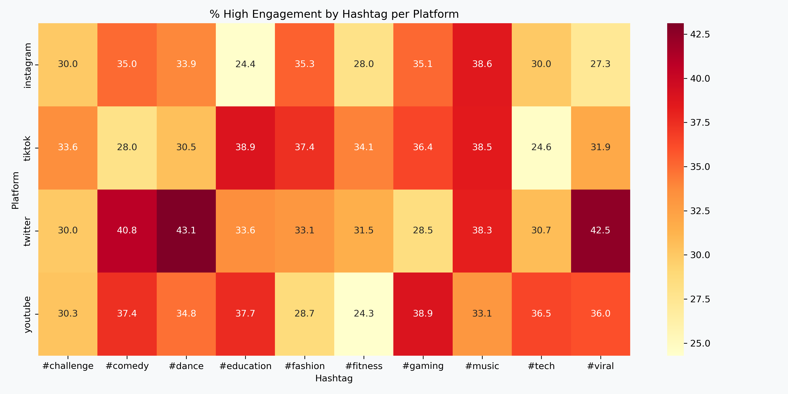

# Portfolio---Analytics

# 🔍 Virality Analysis of Social Media Posts

This project explores what drives **virality** across platforms like **TikTok, Instagram, YouTube, and Twitter (X)** using a dataset of **5,000 viral posts**.

Through exploratory data analysis (EDA), I examined platform trends, content format performance, hashtag strategies, and audience engagement behavior.

📁 This repository contains:
- `virality_analysis.ipynb` – the complete Jupyter Notebook with code and visualizations
- 📊 A detailed breakdown of **univariate**, **bivariate**, and **multivariate analysis**
- 🔎 Insights that help decode what makes content go viral

---

## 📌 Dataset Overview

- **Source:** Kaggle  
- **Posts Analyzed:** 5,000 viral posts  
- **Platforms:** TikTok, Instagram, Twitter, YouTube  
- **Fields:** Platform, Content_Type, Region, Views, Likes, Shares, Comments, Hashtags, Engagement_Level

---

## 🧮 1. Univariate Analysis

### 🔸 Categorical Variables

| Analysis Goal | Output |
|---------------|--------|
| a. Most-used platforms |  |
| b. Dominance of content types |  |
| c. Top regions for viral content |  |
| d. Most common viral hashtags |  |
| e. Engagement label distribution |  |

### 🔸 Numerical Variables

| Analysis Goal | Output |
|---------------|--------|
| a. Distribution and outliers |  |
| b. Central tendency and spread |  |
| c. Total interaction volume |  |
| d. Engagement per view (Efficiency) |  |
| e. Hashtag length distribution |  |

---

## 🔁 2. Bivariate Analysis

### 🔸 Categorical vs Categorical

| Analysis Goal | Output |
|---------------|--------|
| a. Platform vs Engagement Level |  |
| b. Format vs Engagement Level |  |
| c. Region vs Engagement Level |  |
| d. Hashtag vs Engagement |  |
| e. Hashtag length category vs Engagement |  |

### 🔸 Categorical vs Numerical

| Analysis Goal | Output |
|---------------|--------|
| a. Platform vs Total Engagement |  |
| b. Format efficiency per view |  |
| c. Metrics across Engagement Classes |  |

### 🔸 Numerical vs Numerical

| Analysis Goal | Output |
|---------------|--------|
| a. Views vs Likes/Shares |  |
| b. Interaction Strength |  |
| c. Efficient content (low views, high interaction) |  |
| d. Engagement Rate vs Comments |  |

---

## 🔄 3. Multivariate Analysis

| Analysis Goal | Output |
|---------------|--------|
| a. Format × Platform for virality |  |
| b. Format performance by region |  |
| c. Hashtag trends by platform |  |
| d. Content types across engagement levels |  |
| e. Efficiency mapping (ER per view) |  |
| f. Cluster patterns (views, likes, shares, comments) |  |
| g. Feature importance or predictors |  |
| h. Region vs Platform engagement |  |
| i. Format vs Hashtag Length |  |
| j. Reels performance by region |  |
| k. Can shares boost low-view posts? |  |

---

## 💡 Key Takeaways

> - Platform–format fit is essential for virality  
> - Efficient content = high interaction per view  
> - Hashtag strategy and region-specific trends matter  
> - Engagement Rate is more meaningful than raw views

---

## 📦 Tools & Libraries Used

- Python, Jupyter Notebook, Figma, Kaggle  
- `pandas`, `numpy`, `matplotlib`, `seaborn`, `plotly`, `scikit-learn`

---

## 🙌 About Me

I'm a 2nd-year MBA student at **BIM Trichy**, exploring data analytics, storytelling, and digital strategy — one project at a time.

🔗 LinkedIn: [linkedin.com/in/contactanubhavsingh](https://www.linkedin.com/in/contactanubhavsingh)

---
